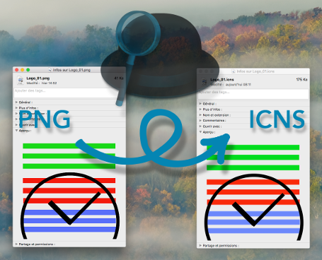

# PNG Image To ICNS Icon

A Alfred's workflow and a bash script to convert a 1024x1024 PNG image to a ICNS icon (`.icns`) for your app.

## Usage

### Alfred Workflow

* Import the workflow (*) in [Alfred](https://www.alfredapp.com/),
* make the 1024x1024 PNG Image,
* choose it in Finder,
* hit CMD+ALT+CTRL+i

Et voilà!

> (*) PNGImage_2_ICNSIcon.alfredworkflow

### Bash Script

        # Make script exectable if necessary
        > chmod +x /path/to/the/png2icns.sh

        # Convert PNG image
        > /path/to/the/png2icns path/to/your/image.png

Et voilà!

## Keybord Shortcut

The shortcut `CMD+ALT+CTRL+I` can be modify in the workflow. Open it in Alfred, double-click on the first element, set your own kb shortcut.
