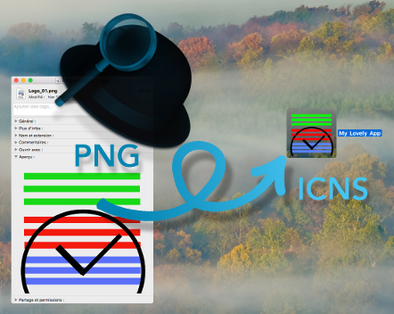

# PNG Image To ICNS Icon

An Alfred's workflow and a bash script to convert a 1024x1024 PNG image to a ICNS icon (`.icns`) for your app.

## Usage

### Alfred Workflow

* Import the workflow (*) in [Alfred](https://www.alfredapp.com/),
* make the 1024x1024 PNG Image,
* choose it in Finder,
* hit CMD+ALT+CTRL+i

Et voilà!

> (*) PNGImage_2_ICNSIcon.alfredworkflow

### Bash Script

        # ===> Download/clone this folder <===

        # Go to your (new) png2icns folder
        > cd /path/to/png2icns/folder/

        # Make `png2icns.sh` script exectable if necessary
        > chmod +x ./png2icns.sh

        # Convert PNG image
        > ./png2icns.sh -v path/to/your/image.png

        # Any help?
        > ./png2icns.sh --help

Et voilà!

To make it commandable:

        > sudo ln /PATH/TO/THE/png2icns.sh /usr/local/bin/png2icns
        # You must set the /PATH/TO/THE path

If you want the command to be `png2icon`:

> sudo ln /PATH/TO/THE/png2icns.sh /usr/local/bin/png2icon
# You must set the /PATH/TO/THE path

Now, you can just do:

        > cd /path/to/the/image.png
        > png2icns -d image.png

        OR

        > png2icon -d image.png

## Keybord Shortcut

The shortcut `CMD+ALT+CTRL+I` can be modify in the workflow. Open it in Alfred, double-click on the first element, set your own kb shortcut.
